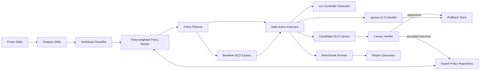

# SchedX-Agent

SchedX-Agent is a Linux adaptive resource-control Agent for mixed workloads. It probes `/proc`, classifies user-space workloads, detects sched_ext/scx availability, and applies safe cgroup v2 CPU controls with rollback and reproducible benchmark reporting.

Current verified platform: openEuler 24.03 LTS SP4 with cgroup v2 and the
config-rebuilt kernel `6.6.0-159.4.3.154.oe2403sp4.schedx1`. The stock SP4
kernel remains installed and is supported through the **cgroup-only fallback**
mode because its binary config does not enable `CONFIG_SCHED_CLASS_EXT`.

## Current Status

Verified on openEuler:

- `schedx status` detects cgroup v2 and reports native sched_ext availability.
- `schedx classify` identifies:
  - `nginx` / `redis-server` as `latency_sensitive`
  - `stress-ng` / `stress-ng-cpu` as `background_noise`
- `schedx optimize --target stress-ng --mode isolate_background` moves stress-ng PIDs into `/sys/fs/cgroup/schedx/pid-<pid>/` and sets `cpu.weight=50`.
- `schedx rollback` restores previous CPU weights and removes empty `pid-*` cgroups. The base `/sys/fs/cgroup/schedx` cgroup is removed when no workload remains.
- `schedx benchmark nginx` runs a three-phase nginx + stress-ng experiment and generates `summary.csv`, `summary.json`, raw wrk output, cgroup snapshots, and `report.md`.
- The SP4 VM passes `137` tests and the fairness-gated native sched_ext run
  reports `62.18%` higher RPS, `33.74%` lower P99, `32.22%` background CPU
  retention and `nr_rejected=0`.
- A real wrk canary accepted a policy with `13.32%` higher RPS, `92.82%` lower
  P99 and `81.86%` background progress retention. A stricter valid gate also
  exercised automatic rollback and left no cgroup or scx task-policy residue.
- The formal four-way ablation reports `86.66%` higher RPS and `72.33%` lower
  P99 for the combined Agent while retaining `43.92%` of background progress.
- In the formal sysbench scenario, CPU interference reduces throughput by
  `46.71%`; SchedX recovers `64.54%` versus the interference phase, reduces
  P95 latency from `2.97 ms` to `0.37 ms`, and retains `27.19%` of background
  progress. The result passes the configured `25%` fairness floor.

## Quick Start

```bash
python3 -m venv .venv
source .venv/bin/activate
pip install -e .

schedx status
schedx probe --top 10
schedx classify --top 50
```

Dry-run is explicit. Commands that change cgroups execute for real unless `--dry-run` is passed:

```bash
schedx optimize --target stress-ng --mode isolate_background --dry-run
sudo schedx optimize --target stress-ng --mode isolate_background
sudo schedx rollback
```

## Architecture



## Commands

- `schedx status`: print platform, cgroup v2, and sched_ext status.
- `schedx policies`: list the allowlisted expert policy catalog and canary outcomes.
- `schedx probe`: collect process, pressure, sched, and cgroup signals.
- `schedx classify`: classify workloads and include rule reasons.
- `schedx optimize`: apply structured cgroup actions or show them with `--dry-run`.
- `schedx control`: manually move a PID into a managed cgroup and set CPU controls.
- `schedx rollback`: restore recorded CPU settings and clean empty SchedX cgroups.
- `schedx benchmark`: run benchmark tools and the nginx mixed workload experiment.
- `schedx report`: generate a Markdown report from result JSON files.
- `schedx tool-run`: execute one AI Agent tool call with an ephemeral cgroup,
  native sched_ext policy, resource-intent profile, metrics, and feedback.

## Adaptive Mixture Of Policies

Automatic rule and LLM proposals pass through a bounded, time-weighted router
before execution. The router uses exponential decay, a confidence threshold,
and a six-second switch cooldown to avoid policy thrashing. After cooldown, a
new expert must remain the winner for two consecutive observations before the
router switches. Explicit CLI modes always bypass automatic routing.

The built-in allowlisted experts are:

| Expert | SchedX mode | Purpose |
| --- | --- | --- |
| `latency_guard` | `latency_first` | Protect nginx, Redis, and other latency-sensitive services. |
| `throughput_boost` | `throughput_first` | Favor sustained batch compute throughput. |
| `background_isolation` | `isolate_background` | Constrain explicitly matched interference processes. |
| `balanced` | `balanced` | Conservative fallback for uncertain observations. |

Inspect the catalog and historical canary outcomes without root privileges:

```bash
schedx policies
```

The router selects an internal policy mode implemented by the existing
`scx_agent`; it never executes a repository entry as a command. When benchmark
or the CLI enables a real wrk baseline/candidate canary, verification
rejects sched_ext task rejections, background starvation, P99 regressions, and
throughput regressions. A rejected canary enters the existing rollback path;
missing objective metrics are recorded separately as inconclusive rather than
as a successful policy outcome.

Enable the real service-SLO closed loop explicitly:

```bash
sudo schedx optimize \
  --target stress-ng \
  --mode isolate_background \
  --canary-url http://127.0.0.1/ \
  --canary-duration 5 \
  --canary-min-background-retention 0.25
```

SchedX runs wrk before and after the candidate policy, measures RPS and P99,
tracks classified background-process CPU progress, checks `nr_rejected`, and
rolls back both cgroup and persistent scx task policies when a safety gate
fails. Canary execution is skipped during `--dry-run`.

## Agent Tool-Call Resource Control

SchedX treats each test, compile, package installation, interactive command, or
background job as an independent resource-control unit:

```text
/sys/fs/cgroup/schedx-agents/<agent-id>/tool-<timestamp>-<pid>/
```

Example:

```bash
sudo schedx tool-run --agent-id coding-agent --intent auto -- pytest -q
sudo schedx tool-run --agent-id coding-agent --intent compile -- make -j4
sudo AGENT_RESOURCE_HINT=intent:compile,memory:high,cpu:high \
  schedx tool-run --agent-id coding-agent -- make -j4
```

The wrapper automatically:

- infers resource intent and selects a sched_ext class and weight;
- accepts the standardized `AGENT_RESOURCE_HINT` Agent-to-OS intent protocol;
- applies `cpu.weight`, `cpu.max`, `memory.high`, `memory.max`, and `pids.max`;
- records duration, CPU statistics, `memory.peak`, memory events, and peak PIDs;
- translates kernel pressure into a reusable `next_resource_hint` for the
  Agent's next planning round;
- removes the ephemeral cgroup after the tool exits;
- emits `[schedx-feedback]` messages when memory pressure, OOM, CPU throttling,
  or command failure is detected.

Run the reproducible demonstration:

```bash
sudo bash scripts/run_agent_tool_demo.sh
```

Run the formal unmanaged-versus-managed Agent tool-call experiment:

```bash
sudo python3 scripts/run_tool_call_experiment.py \
  --repeats 5 \
  --output results/tool-call-formal \
  -- python3 -m pytest -q
```

The experiment runs the same tool call under full CPU contention and reports
tool-call latency, success rate, native sched_ext activation, and background
CPU retention.

## Persistent sched_ext Daemon

For concurrent Agents, one systemd-managed daemon owns the sched_ext struct_ops
link and exposes serialized policy updates over `/run/schedx/scx-daemon.sock`.
Each `tool-run` registers and removes only its own PID policy.

```bash
sudo install -m 0644 scripts/schedx-scx-daemon.service /etc/systemd/system/
sudo systemctl daemon-reload
sudo systemctl enable --now schedx-scx-daemon
sudo schedx scx-daemon status
sudo python3 scripts/verify_scx_daemon_concurrency.py
```

When the daemon is unavailable, `tool-run` retains its standalone sched_ext and
cgroup-only fallback paths.

The daemon also applies PSI-driven cross-class fairness. Tool calls register
their ephemeral cgroup rather than a single PID, so all descendants inherit the
sched_ext class and weighted-vtime policy:

```bash
sudo python3 scripts/verify_scx_cgroup_inheritance.py
sudo python3 scripts/verify_adaptive_fairness.py
```

The adaptive scheduler preserves a configurable background service floor while
keeping latency work preferred. Runtime and formal benchmarks now share the
same initial background service interval of `64`; the daemon adjusts it from
observed runtime share instead of starting from the old unvalidated `2048`.

Each managed cgroup exposes scheduler-level `enqueues`, `runs`, `runtime_ns`,
and `wait_ns`. The daemon uses runtime-share deltas for closed-loop tuning, and
the metrics are included in each `tool-run` JSON result:

```bash
sudo schedx scx-daemon metrics
sudo python3 scripts/verify_closed_loop_convergence.py
```

The latest fairness-gated SP4 comparison uses 10-second samples and 3 repeats.
It reports `62.18%` higher mean RPS, `33.74%` lower mean P99 and `32.22%`
background CPU retention against a required minimum of `25%`.

## DeepSeek V4 Policy Agent

SchedX can use `deepseek-v4-pro` as a real policy-planning Agent. The model
receives workload classification, PSI, CPU topology, native sched_ext status,
and a safe rule-based baseline. It returns a strict JSON policy proposal.

The proposal cannot execute commands directly. SchedX validates the mode,
target process, parameter names, quotas, weights, and nice ranges before the
existing Policy/Act/Verify/Rollback pipeline can use it. API failures or unsafe
proposals automatically fall back to the deterministic rule engine.

Store credentials outside the repository:

```bash
sudo install -d -m 0700 /etc/schedx
sudo install -m 0600 .env.example /etc/schedx/llm.env
sudoedit /etc/schedx/llm.env

sudo schedx llm-plan
sudo schedx optimize --llm-policy --dry-run
sudo schedx run --llm-policy --max-rounds 3
```

Run the formal DeepSeek-versus-rule scheduling comparison:

```bash
sudo python3 scripts/run_llm_policy_experiment.py \
  --duration 10 \
  --repeats 3 \
  --output results/llm-policy-comparison
```

## Competition Demo And Final Report

The one-click demo runs environment preflight, four-way nginx ablation, batch
throughput, accepted and rejected SLO canaries, cleanup verification, and report
generation. The default remains an offline-compatible rule-policy path:

```bash
sudo bash scripts/run_competition_demo.sh
```

For the judge-facing Agent-first demonstration, load the protected LLM
configuration and enable the compact decision trace:

```bash
set -a
source /etc/schedx/llm.env
set +a
sudo --preserve-env=SCHEDX_LLM_API_KEY,SCHEDX_LLM_MODEL,SCHEDX_LLM_BASE_URL \
  bash scripts/run_competition_demo.sh --llm-policy --compact
```

This path records the LLM proposal, learned expert route, Skill phases, Canary
verdict, and rollback summary in `agent-trace.json`. The first Canary exercises
an accepted policy. The second applies the policy and then requires a 99.9% P99
latency improvement, intentionally demonstrating a post-action SLO rejection and
automatic rollback without fabricating benchmark results.

The default is a short presentation run. Use the formal profile for repeated
20-second measurements:

```bash
sudo bash scripts/run_competition_demo.sh --formal
```

Run either experiment independently:

```bash
sudo schedx benchmark nginx-ablation \
  --duration 20 --repeats 3 --connections 64 --threads 4 \
  --stress-cpu 4 --output results/nginx-ablation

sudo schedx benchmark batch-throughput \
  --duration 20 --repeats 3 --threads 4 \
  --stress-cpu 4 --output results/batch-throughput
```

Generate the judge-facing summary report:

```bash
python3 scripts/generate_competition_report.py \
  --results results \
  --output reports/competition-final.md
```

Current verified highlights:

- native sched_ext fairness-gated result: `62.18%` RPS gain, `33.74%` P99
  reduction and `32.22%` background CPU retention;
- DeepSeek-guided policy result: `84.96%` RPS gain and `55.16%` P99 reduction;
- multi-Agent LLM experiment: `6/6` tools used native sched_ext through daemon mode;
- final daemon state after validation: `sched_ext=enabled`, scheduler `schedx_agent`, `nr_rejected=0`.

The ablation compares `default`, `cgroup_only`, `scx_only`, and
`agent_combined`. It records background CPU retention and marks a row invalid
for performance claims when the configured fairness floor is not met.

Latest formal artifacts:

```text
results/competition-demo/2026-07-16_07-38-05/
reports/competition-final.md
```

## Nginx Mixed Workload Benchmark

Install and start nginx:

```bash
sudo systemctl enable --now nginx
curl -I http://127.0.0.1/
```

Install wrk if needed:

```bash
scripts/install_wrk.sh
```

Run the reproducible three-phase experiment:

```bash
schedx benchmark nginx \
  --url http://127.0.0.1/ \
  --duration 20 \
  --connections 32 \
  --threads 4 \
  --repeats 3 \
  --stress-cpu 4 \
  --output results/nginx_benchmark
```

The benchmark creates a timestamped directory:

```text
results/nginx_benchmark/<timestamp>/
  env.json
  status.json
  baseline_wrk_repeat*.txt
  interference_wrk_repeat*.txt
  interference_classify.json
  schedx_wrk_repeat*.txt
  schedx_classify.json
  schedx_optimize.json
  cgroup_snapshot_before.json
  cgroup_snapshot_after_optimize.json
  rollback.json
  summary.csv
  summary.json
  report.md
```

Check cleanup:

```bash
test ! -d /sys/fs/cgroup/schedx && echo cleanup-ok
```

## Example Result

One openEuler smoke-test run with `duration=5`, `connections=8`, `threads=2`, `repeats=1`, `stress_cpu=4` produced:

| Phase | Requests/sec | Avg Latency ms | P99 ms |
| --- | ---: | ---: | ---: |
| Baseline | 94626.15 | 0.0935 | 0.58 |
| Interference | 35430.07 | 0.735 | 4.20 |
| SchedX | 36266.89 | 0.626 | 4.07 |

The run showed 62.56% RPS drop under interference, 2.36% RPS recovery with SchedX, 14.83% average-latency reduction versus interference, and successful cgroup cleanup. Results are not fabricated; benchmark output is saved under the timestamped result directory.

## Safety Model

SchedX-Agent executes structured actions only. It does not execute model-generated shell commands. The isolate policy protects control-plane processes such as `schedx`, `python -m schedx`, `bash`, `sshd`, `systemd`, `NetworkManager`, `firewalld`, and `tuned`.

cgroup writes are recorded in `.schedx/rollback.json` before mutation, and
persistent scx task policies are recorded in `.schedx/scx_rollback.json`.
`schedx rollback` removes both policy types, restores recorded values and
removes empty `/sys/fs/cgroup/schedx/pid-*` groups. If a process is still alive,
cleanup is skipped with a reason such as `process_still_alive`.

## sched_ext/scx

SchedX-Agent detects `/sys/kernel/sched_ext` and reports whether sched_ext is
available. `scx/scx_agent.bpf.c` is a native `sched_ext_ops` scheduler with
class-specific dispatch queues for latency, default/batch, and background
tasks. The stock openEuler SP4 kernel automatically uses the cgroup-only
fallback.

The SP4 source RPM already contains sched_ext source code. The reproducible
config-only kernel rebuild, source checksum, installation dry-run and stock
kernel rollback procedure are under
`kernel/openEuler-24.03-LTS-SP4/README.md`.
