# SchedX-Agent System Design

## Goal

SchedX-Agent is an adaptive Linux resource-control Agent for mixed workloads.
It protects latency-sensitive services from background CPU interference while
preserving measurable progress for background and batch workloads.

The implementation uses Python for Agent orchestration and C/eBPF for the
native `sched_ext` scheduler.

## Control Loop

```mermaid
flowchart LR
    P["ProbeSkill<br/>procfs, PSI, cgroup"] --> A["AnalyzeSkill<br/>workload classification"]
    A --> L["LLM/Rule Policy<br/>structured proposal"]
    L --> G["PolicySkill<br/>allowlist and range checks"]
    G --> B["CanaryBaselineSkill<br/>measure before action"]
    B --> E["EbpfLoad/AttachSkill<br/>attach observation and policy hooks"]
    E --> S["ScxSkill + ActSkill<br/>sched_ext and cgroup v2"]
    S --> EP["EbpfPolicySkill<br/>cgroup-scoped map updates"]
    EP --> C["CanaryCandidateSkill<br/>measure after action"]
    C --> ES["EbpfStatsSkill<br/>kernel evidence"]
    ES --> V["VerifySkill<br/>SLO and fairness gate"]
    V -->|"accepted"| R["ReportSkill"]
    V -->|"rejected"| X["RollbackSkill"]
    X --> R
```

Every phase implements the common `Skill.run(AgentContext) -> SkillResult`
interface. The Agent records completed phases, decisions, actions, measurements
and rollback evidence in structured JSON.

## Workload Awareness

The probe layer reads:

- process identity, command line, CPU time, RSS and parent relationship;
- `/proc/[pid]/sched` scheduling counters;
- CPU, memory and I/O pressure;
- cgroup v2 CPU statistics and pressure;
- CPU topology and native sched_ext state.

The classifier recognizes latency-sensitive services, batch computation,
background interference and mixed workloads. Kernel threads and protected
control processes such as `schedx`, `sshd` and `systemd` are excluded from
resource-isolation actions.

## Policy Decision

The policy layer combines deterministic safety rules with an optional
DeepSeek proposal. The model produces a structured mode, target and bounded
parameters; it cannot issue shell commands. A learned router selects one of
the latency, throughput, balanced or background-isolation experts.

The candidate is accepted only after a bounded canary compares:

- requests per second;
- P99 latency;
- background CPU runtime relative to the baseline;
- sched_ext rejected-task count.

## Native sched_ext Backend

`scx/scx_agent.bpf.c` is a real `sched_ext_ops` scheduler. It provides:

- independent latency, ordinary, batch and background dispatch queues;
- per-task and per-cgroup policy maps;
- round-robin latency and ordinary ordering with capped, weight-scaled slices,
  and weighted virtual-time ordering for batch and background work;
- configurable cross-class fairness;
- dispatch and cgroup runtime metrics.

A persistent daemon owns the single struct_ops scheduler instance and accepts
whitelisted policy commands over a Unix socket. Systems without sched_ext
automatically use the cgroup-only fallback.

## cgroup v2 Backend

The cgroup controller creates `/sys/fs/cgroup/schedx/pid-<pid>` groups and can
apply CPU weight, CPU quota and CPU affinity controls. Every mutation records
its previous value. Rollback restores values, removes persistent scx policies
and deletes empty cgroups.

On the verified SP4 kernel, cgroup CPU quotas and relative cgroup weights are
effective with the default fair scheduler. Native `schedx_agent` weights use
policy maps, and this kernel does not enforce `cpu.max` for its sched_ext tasks.
Hard CPU quotas therefore require cgroup-only operation with the native
scheduler disabled; memory and PID controls remain managed by cgroup v2.

Recovery journals are locked and replaced atomically. They retain failed
entries and separate session ownership from individual candidate transactions,
so rejecting a later candidate can restore previously accepted settings. eBPF
pins are scoped to the state directory, and an explicit rollback is required
before taking over hooks owned by a different session in that scope.

Latency and ordinary work use round-robin order because a mixture of sleeping
and busy tasks caused multi-second queue waits with virtual-time ordering on
the SP4 kernel. Batch and background classes retain virtual-time ordering with weight-scaled
idle credit. Execution timestamps charge virtual time, with remaining-slice
accounting as a fallback when task storage is unavailable. Kernel validation
checks observed queue waits against configurable latency and ordinary budgets
(2 and 3 seconds by default), plus 2-second batch and background budgets;
these are experimental acceptance thresholds, not hard real-time guarantees.

## eBPF Extension Boundary

The repository includes four independent, pinned eBPF hook families:
scheduler tracing, cgroup-v2 network policy, resource-policy telemetry and an
inode-scoped BPF LSM execution policy. `EbpfController` performs real attach,
detach and map updates through bpftool. Resource limits remain enforced by
cgroup v2 and CPU scheduling remains owned by the native sched_ext struct_ops
program; the observation hooks do not pretend to replace either subsystem.

The Agent attaches hooks before mutation, creates and populates dedicated
cgroups, then updates network, resource-intent and audit-only security maps by
cgroup ID. The same controller instance supplies post-action statistics. An
accepted policy remains pinned and active; `schedx rollback`, including a new
CLI process, discovers the pinned state, detaches links and removes maps after
restoring cgroup and sched_ext state.

## Reproducibility

The project provides:

- openEuler 24.03 LTS SP4 setup and kernel-rebuild scripts;
- short live-demo and formal repeated experiment profiles;
- nginx four-way ablation and batch-throughput scenarios;
- raw outputs, JSON summaries, fairness checks and Markdown reports;
- cleanup verification after every experiment.

