# SchedX-Agent System Design

## Goal

SchedX-Agent is an adaptive Linux resource-control Agent for mixed workloads.
It protects latency-sensitive services from background CPU interference while
preserving measurable progress for background and batch workloads.

The implementation uses Python for Agent orchestration and C/eBPF for the
native `sched_ext` scheduler.

## Control Loop

```mermaid
flowchart LR
    P["ProbeSkill<br/>procfs, PSI, cgroup"] --> A["AnalyzeSkill<br/>workload classification"]
    A --> L["LLM/Rule Policy<br/>structured proposal"]
    L --> G["PolicySkill<br/>allowlist and range checks"]
    G --> B["CanaryBaselineSkill<br/>measure before action"]
    B --> S["ScxSkill + ActSkill<br/>sched_ext and cgroup v2"]
    S --> C["CanaryCandidateSkill<br/>measure after action"]
    C --> V["VerifySkill<br/>SLO and fairness gate"]
    V -->|"accepted"| R["ReportSkill"]
    V -->|"rejected"| X["RollbackSkill"]
    X --> R
```

Every phase implements the common `Skill.run(AgentContext) -> SkillResult`
interface. The Agent records completed phases, decisions, actions, measurements
and rollback evidence in structured JSON.

## Workload Awareness

The probe layer reads:

- process identity, command line, CPU time, RSS and parent relationship;
- `/proc/[pid]/sched` scheduling counters;
- CPU, memory and I/O pressure;
- cgroup v2 CPU statistics and pressure;
- CPU topology and native sched_ext state.

The classifier recognizes latency-sensitive services, batch computation,
background interference and mixed workloads. Kernel threads and protected
control processes such as `schedx`, `sshd` and `systemd` are excluded from
resource-isolation actions.

## Policy Decision

The policy layer combines deterministic safety rules with an optional
DeepSeek proposal. The model produces a structured mode, target and bounded
parameters; it cannot issue shell commands. A learned router selects one of
the latency, throughput, balanced or background-isolation experts.

The candidate is accepted only after a bounded canary compares:

- requests per second;
- P99 latency;
- background CPU runtime relative to the baseline;
- sched_ext rejected-task count.

## Native sched_ext Backend

`scx/scx_agent.bpf.c` is a real `sched_ext_ops` scheduler. It provides:

- latency, default/batch and background dispatch queues;
- per-task and per-cgroup policy maps;
- weighted virtual-time ordering;
- configurable cross-class fairness;
- dispatch and cgroup runtime metrics.

A persistent daemon owns the single struct_ops scheduler instance and accepts
whitelisted policy commands over a Unix socket. Systems without sched_ext
automatically use the cgroup-only fallback.

## cgroup v2 Backend

The cgroup controller creates `/sys/fs/cgroup/schedx/pid-<pid>` groups and can
apply CPU weight, CPU quota and CPU affinity controls. Every mutation records
its previous value. Rollback restores values, removes persistent scx policies
and deletes empty cgroups.

## eBPF Extension Boundary

The repository includes standardized eBPF Skills, controller interfaces and
program prototypes for scheduler tracing, network policy and resource
monitoring. The independent trace/network/resource hooks are extension work
and are not claimed as production-attached features in the current release.
The native sched_ext scheduler itself is a validated BPF struct_ops program.

## Reproducibility

The project provides:

- openEuler 24.03 LTS SP4 setup and kernel-rebuild scripts;
- short live-demo and formal repeated experiment profiles;
- nginx four-way ablation and batch-throughput scenarios;
- raw outputs, JSON summaries, fairness checks and Markdown reports;
- cleanup verification after every experiment.

