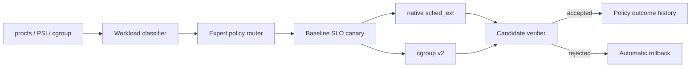
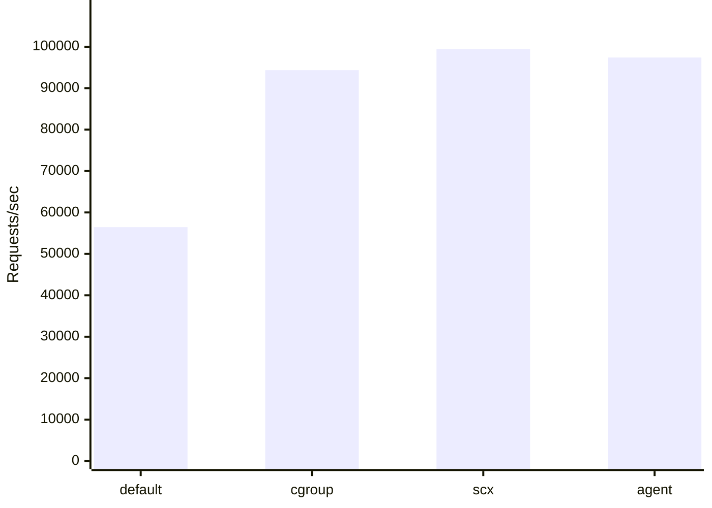
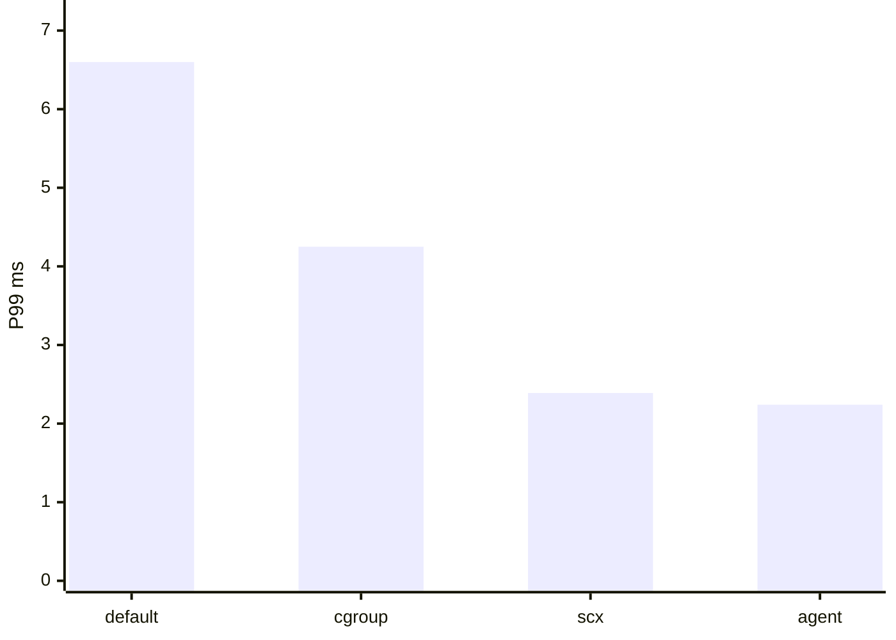
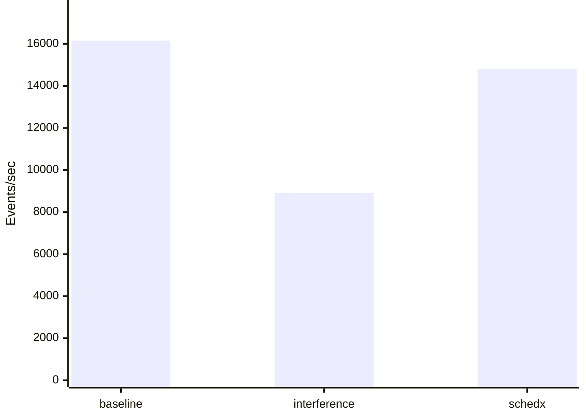

# SchedX-Agent Competition Report

## 1. Executive Summary

SchedX-Agent is an adaptive Linux resource-control Agent for mixed workloads.
It combines workload sensing, allowlisted expert routing, native sched_ext,
cgroup v2 enforcement, real SLO canaries, and automatic rollback.

- Demo artifact: `results/competition-agent-llm/2026-07-17_07-50-10`
- Demo status: `ok`
- Agent version: `0.4.0`
- Kernel: `Linux-6.6.0-159.4.3.154.oe2403sp4.schedx1-x86_64-with-glibc2.38`
- Runtime mode: `sched_ext-native`

## 2. Architecture



## 3. Four-Way Nginx Ablation

| Phase | Mean RPS | Mean P99 (ms) | RPS gain | P99 reduction | Background retention | Valid |
| --- | ---: | ---: | ---: | ---: | ---: | --- |
| default | 56446.79 | 6.60 | 0.00% | 0.00% | 100.00% | True |
| cgroup_only | 94335.71 | 4.25 | 67.12% | 35.62% | 47.32% | True |
| scx_only | 99401.92 | 2.39 | 76.10% | 63.72% | 46.04% | True |
| agent_combined | 97397.92 | 2.24 | 72.55% | 66.04% | 47.03% | True |

### RPS



### P99 Latency



The ablation isolates default Linux scheduling, cgroup-only control,
native scx-only control, and the combined adaptive Agent.
Only rows meeting the background-progress floor are valid performance claims.

## 4. Batch Throughput Scenario

| Phase | Mean events/s | P95 latency (ms) | Gain vs interference |
| --- | ---: | ---: | ---: |
| baseline | 16158.01 | 0.36 | 81.44% |
| interference | 8905.41 | 2.93 | 0.00% |
| schedx | 14802.46 | 0.36 | 66.22% |

### Batch Throughput



The SchedX phase identifies a live sysbench workload and applies the
throughput expert while CPU interference remains active.

## 5. Canary And Rollback Evidence

### Accepted gate

- Final status: `success`
- Verdict: `accepted`
- RPS change: 14.34%
- P99 delta (negative is better): -92.68%
- Background retention: 75.25%
- Rollback evidence present: `False`

### Strict rollback gate

- Final status: `rolled_back`
- Verdict: `rejected`
- RPS change: 11.17%
- P99 delta (negative is better): -92.25%
- Background retention: 73.64%
- Rollback evidence present: `True`


## 6. Existing Native sched_ext Evidence

- RPS gain: 62.18%
- P99 reduction: 33.74%
- Background retention: 32.22%
- Valid for claims: `True`

## 7. Optional LLM Evidence

- Source: `deepseek-v4`
- Mode: `latency_first`
- Target: `nginx`
- RPS gain: 84.96%
- P99 reduction: 55.16%

## 8. Reproduction

```bash
sudo bash scripts/run_competition_demo.sh
sudo bash scripts/run_competition_demo.sh --formal
python3 -m pytest -q
```

The short demo is presentation evidence. Formal claims should use
the repeated `--formal` run and retain all raw wrk/sysbench outputs.

## 9. Limitations

- Current formal evidence focuses on CPU contention and should not be generalized to every workload.
- Same-host load generation can introduce client-side contention; an external load generator is preferable for final measurements.
- Network and security eBPF agents remain extension points rather than completed competition claims.
- LLM policy planning is optional; safety and execution do not depend on model availability.