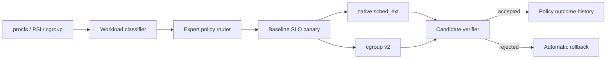
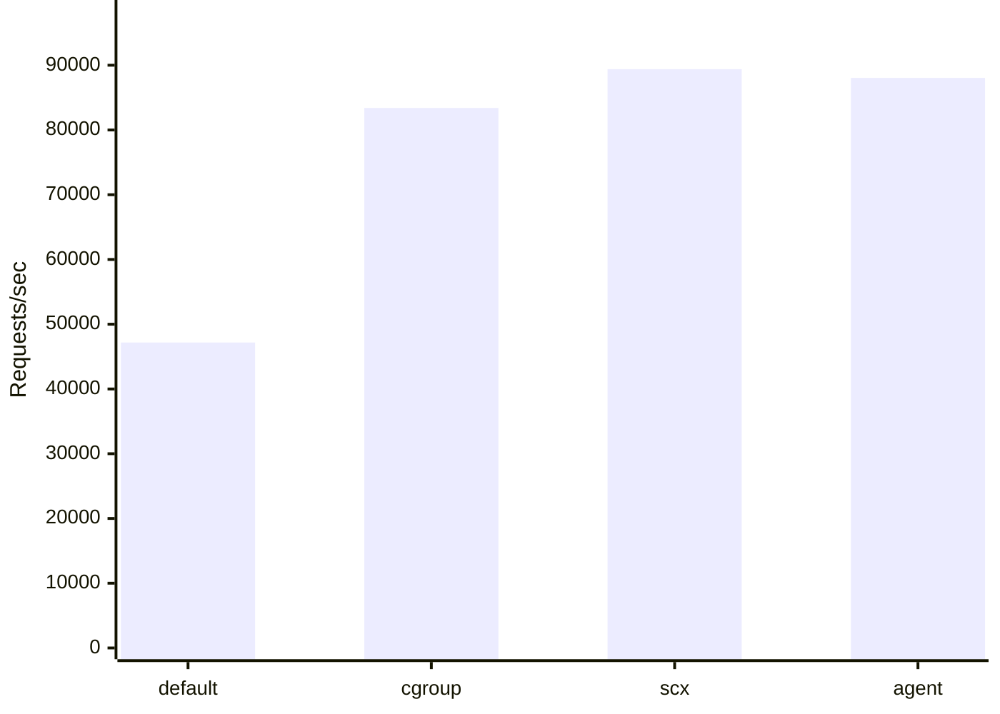
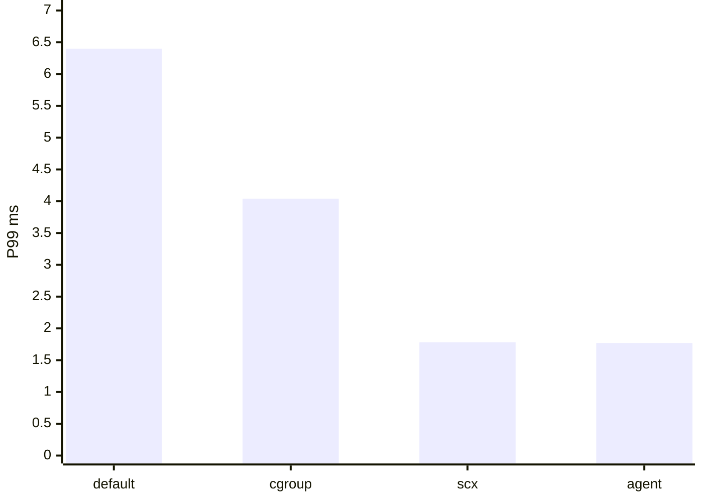
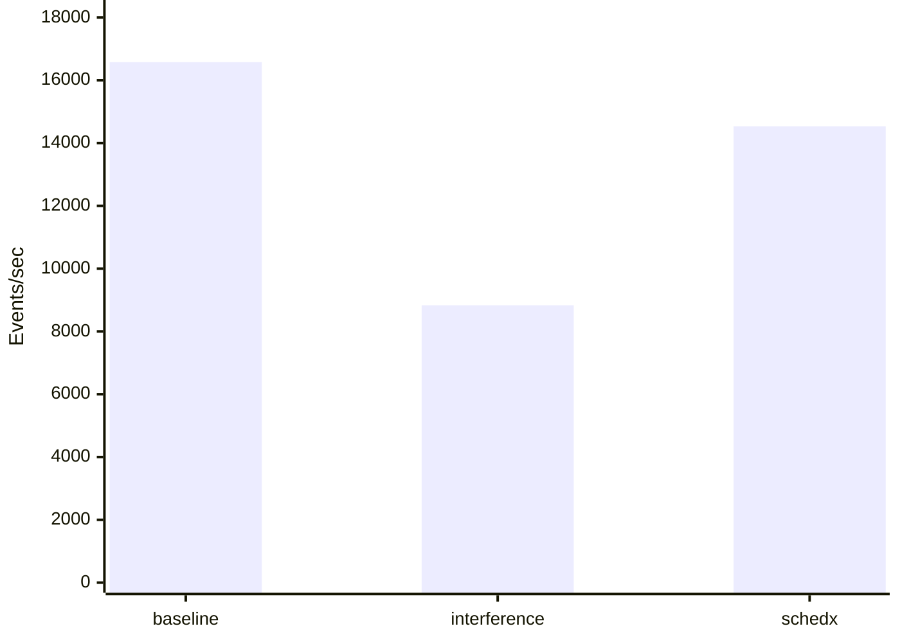

# SchedX-Agent Competition Report

## 1. Executive Summary

SchedX-Agent is an adaptive Linux resource-control Agent for mixed workloads.
It combines workload sensing, allowlisted expert routing, native sched_ext,
cgroup v2 enforcement, real SLO canaries, and automatic rollback.

- Demo artifact: `results/competition-demo/2026-07-16_07-38-05`
- Demo status: `ok`
- Agent version: `0.4.0`
- Kernel: `Linux-6.6.0-159.4.3.154.oe2403sp4.schedx1-x86_64-with-glibc2.38`
- Runtime mode: `sched_ext-native`

## 2. Architecture



## 3. Four-Way Nginx Ablation

| Phase | Mean RPS | Mean P99 (ms) | RPS gain | P99 reduction | Background retention | Valid |
| --- | ---: | ---: | ---: | ---: | ---: | --- |
| default | 47169.78 | 6.40 | 0.00% | 0.00% | 100.00% | True |
| cgroup_only | 83402.73 | 4.04 | 76.81% | 36.79% | 44.11% | True |
| scx_only | 89390.59 | 1.78 | 89.51% | 72.17% | 44.70% | True |
| agent_combined | 88045.48 | 1.77 | 86.66% | 72.33% | 43.92% | True |

### RPS



### P99 Latency



The ablation isolates default Linux scheduling, cgroup-only control,
native scx-only control, and the combined adaptive Agent.
Only rows meeting the background-progress floor are valid performance claims.

## 4. Batch Throughput Scenario

| Phase | Mean events/s | P95 latency (ms) | Gain vs interference | Background progress | Valid |
| --- | ---: | ---: | ---: | ---: | --- |
| baseline | 16575.14 | 0.37 | 87.64% | 0.00% | n/a |
| interference | 8833.67 | 2.97 | 0.00% | 100.00% | n/a |
| schedx | 14535.26 | 0.37 | 64.54% | 27.19% | True |

### Batch Throughput



The SchedX phase identifies a live sysbench workload and applies the
throughput expert while CPU interference remains active.

## 5. Canary And Rollback Evidence

### Accepted gate

- Final status: `success`
- Verdict: `accepted`
- RPS change: 19.18%
- P99 delta (negative is better): -94.52%
- Background retention: 73.00%
- Rollback evidence present: `False`

### Strict rollback gate

- Final status: `rolled_back`
- Verdict: `rejected`
- RPS change: 6.65%
- P99 delta (negative is better): -93.36%
- Background retention: 73.25%
- Rollback evidence present: `True`


## 6. Existing Native sched_ext Evidence

- RPS gain: 62.18%
- P99 reduction: 33.74%
- Background retention: 32.22%
- Valid for claims: `True`

## 7. Optional LLM Evidence

- Source: `deepseek-v4`
- Mode: `latency_first`
- Target: `nginx`
- RPS gain: 84.96%
- P99 reduction: 55.16%

## 8. Reproduction

```bash
sudo bash scripts/run_competition_demo.sh
sudo bash scripts/run_competition_demo.sh --formal
python3 -m pytest -q
```

The short demo is presentation evidence. Formal claims should use
the repeated `--formal` run and retain all raw wrk/sysbench outputs.

## 9. Limitations

- Current formal evidence focuses on CPU contention and should not be generalized to every workload.
- Same-host load generation can introduce client-side contention; an external load generator is preferable for final measurements.
- Network and security eBPF agents remain extension points rather than completed competition claims.
- LLM policy planning is optional; safety and execution do not depend on model availability.