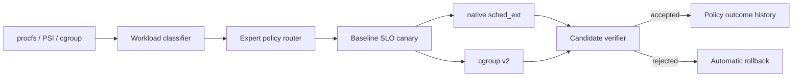
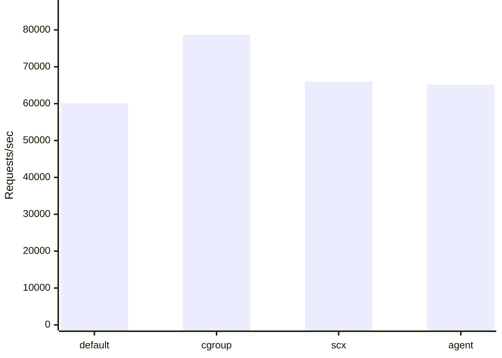
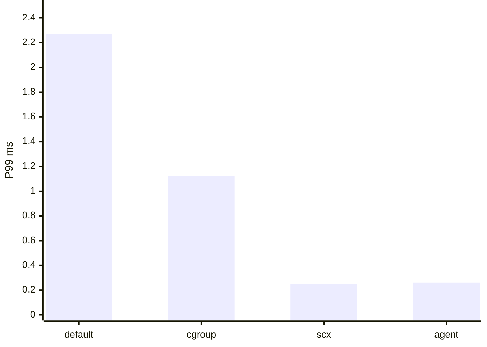
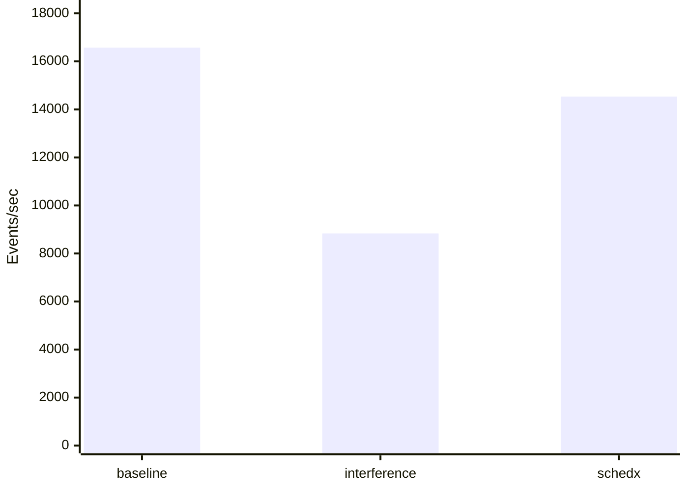

# SchedX-Agent Competition Report

## 1. Executive Summary

SchedX-Agent is an adaptive Linux resource-control Agent for mixed workloads.
It combines workload sensing, allowlisted expert routing, native sched_ext,
cgroup v2 enforcement, real SLO canaries, and automatic rollback.

- Demo artifact: `results/video-recording/2026-08-29_20-46-54`
- Demo status: `ok`
- Agent version: `0.4.0`
- Kernel: `Linux-6.6.0-159.4.3.154.oe2403sp4.schedx1-x86_64-with-glibc2.38`
- Runtime mode: `sched_ext-native`

## 2. Architecture



## 3. Four-Way Nginx Ablation

| Phase | Mean RPS | Mean P99 (ms) | RPS gain | P99 reduction | Background retention | Valid |
| --- | ---: | ---: | ---: | ---: | ---: | --- |
| default | 60156.46 | 2.27 | 0.00% | 0.00% | 100.00% | True |
| cgroup_only | 78703.17 | 1.12 | 30.83% | 50.66% | 25.20% | True |
| scx_only | 65972.53 | 0.25 | 9.67% | 88.94% | 98.21% | True |
| agent_combined | 65154.59 | 0.26 | 8.31% | 88.50% | 96.59% | True |

### RPS



### P99 Latency



The ablation isolates default Linux scheduling, cgroup-only control,
native scx-only control, and the combined adaptive Agent.
Only rows meeting the background-progress floor are valid performance claims.

## 4. Batch Throughput Scenario

| Phase | Mean events/s | P95 latency (ms) | Gain vs interference | Background progress | Valid |
| --- | ---: | ---: | ---: | ---: | --- |
| baseline | 16575.14 | 0.37 | 87.64% | 0.00% | n/a |
| interference | 8833.67 | 2.97 | 0.00% | 100.00% | n/a |
| schedx | 14535.26 | 0.37 | 64.54% | 27.19% | True |

### Batch Throughput



The SchedX phase identifies a live sysbench workload and applies the
throughput expert while CPU interference remains active.

## 5. Canary And Rollback Evidence

### Accepted gate

- Final status: `success`
- Verdict: `accepted`
- RPS change: 1.78%
- P99 delta (negative is better): -86.96%
- Background retention: 93.00%
- Rollback evidence present: `False`

### Strict rollback gate

- Final status: `rolled_back`
- Verdict: `rejected`
- RPS change: -2.09%
- P99 delta (negative is better): -86.10%
- Background retention: 105.14%
- Rollback evidence present: `True`


## 6. Native sched_ext Scheduler Comparison

| Scheduler | Capability | Mean RPS | Mean P99 (ms) | RPS gain | P99 reduction | Background retention | Valid |
| --- | --- | ---: | ---: | ---: | ---: | ---: | --- |
| default | none | 63804.61 | 7.49 | n/a | n/a | 100.00% | True |
| scx_simple | lifecycle_only | 86021.22 | 24.07 | 34.82% | -221.25% | 70.61% | True |
| scx_qmap | lifecycle_only | 5476.45 | 21.34 | -91.42% | -184.81% | 179.56% | True |
| scx_flatcg | lifecycle_only | 86154.63 | 23.84 | 35.03% | -218.18% | 70.32% | True |
| scx_agent | task_policy_and_fairness | 114224.98 | 2.99 | 79.02% | 60.04% | 30.48% | True |

The same repeated harness compares the default scheduler with allowlisted
upstream scx examples and SchedX's task-policy scheduler. Capability labels
prevent lifecycle-only schedulers from being presented as adaptive Agents.

## 7. Existing Native sched_ext Evidence

- RPS gain: 62.18%
- P99 reduction: 33.74%
- Background retention: 32.22%
- Valid for claims: `True`

## 8. Real eBPF Evidence

The Agent loop loads and attaches scheduler, network, resource, and security
BPF programs, updates allowlisted maps, collects counters for verification,
and removes pinned hooks through the same rollback path.

## 9. Optional LLM Evidence

- Source: `deepseek-v4`
- Mode: `latency_first`
- Target: `nginx`
- RPS gain: 84.96%
- P99 reduction: 55.16%

## 10. Reproduction

```bash
sudo bash scripts/run_competition_demo.sh
sudo bash scripts/run_competition_demo.sh --formal
sudo schedx benchmark scx-compare --schedulers scx_simple,scx_qmap,scx_flatcg,scx_agent --duration 20 --repeats 5
python3 -m pytest -q
```

The short demo is presentation evidence. Formal claims should use
the repeated `--formal` run and retain all raw wrk/sysbench outputs.

## 11. Limitations

- Current formal evidence focuses on CPU contention and should not be generalized to every workload.
- Same-host load generation can introduce client-side contention; an external load generator is preferable for final measurements.
- Network and security eBPF programs currently enforce bounded map policies and audit evidence; full production firewall or mandatory-access-control semantics remain future work.
- LLM policy planning is optional; safety and execution do not depend on model availability.